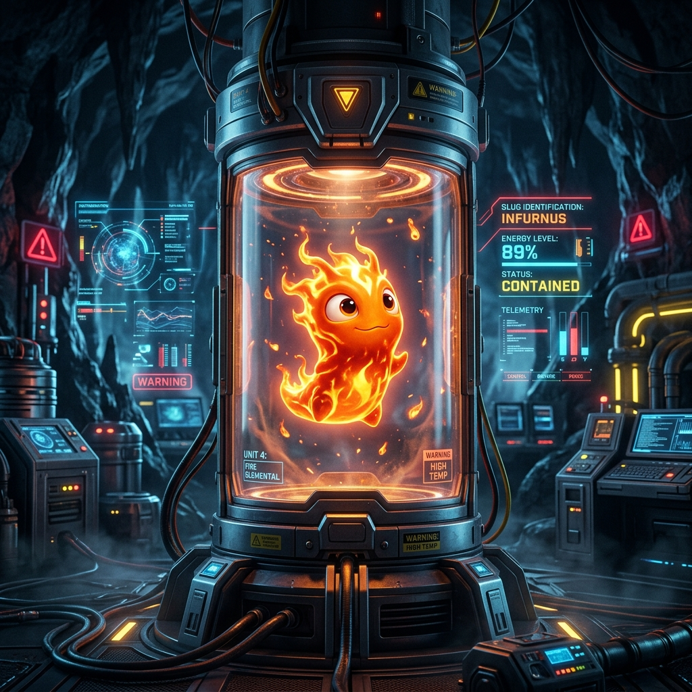

# 🐌 Slugterra: Cavern Clash

A fully on-chain PvP battle game built on [Sui](https://sui.io). Collect, evolve, and battle elemental slugs as NFTs.



---

## What is this?

Slugterra is a Web3 game where you collect elemental slug creatures, level them up, evolve them through different tiers, and battle other players in the Cavern Arena. Every slug is an NFT on Sui — you own it, you trade it, you battle with it.

### Features

- 🎮 **PvE Battles** — Fight AI opponents to earn Dark Coins and XP
- ⚔️ **PvP Arena** — Challenge other players in the Cavern Arena
- 🧬 **Evolution System** — Slugs evolve through tiers (Rookie → Veteran → Elite → Mega → Omega)
- 🎰 **Quantum Reactor** — Spin for rewards, coins, and rare slug drops
- 🖼️ **NFT Minting** — Mint your slugs on-chain as Sui NFTs
- 📖 **Field Guide** — Browse all 15 elemental slug types and their stats
- 🏆 **Leaderboard** — Compete for the top spot
- 🌊 **Cinematic Intro** — Scroll-driven 200-frame transformation sequence

### Slug Elements

| Element | Slug | Element | Slug |
|---------|------|---------|------|
| 🔥 Fire | Infurnus | 💧 Water | Aquabeek |
| 🌍 Earth | Rammstone | 💨 Air | Zephyr |
| ❄️ Frost | Chiller | 🌋 Magma | Lavalynx |
| ☠️ Toxic | Gastrodon | 🌫️ Steam | Vaporex |
| ⚡ Plasma | Tazerling | 🏜️ Sand | Sandsurge |
| 👻 Shadow | Nightshade | 🌑 Abyss | Abyssal |
| 💀 Necro | Cryptogrif | 🕳️ Void | Voidwalker |
| 🔥 Inferno | Pyroxin | | |

---

## Tech Stack

| Layer | Tech |
|-------|------|
| Frontend | React 19, TypeScript, Framer Motion, Three.js |
| Backend | Express 5, Node.js |
| Database | MongoDB Atlas |
| Blockchain | Sui (Move smart contracts) |
| Wallet | @mysten/dapp-kit (Sui Wallet, Suiet, Ethos) |
| Deployment | Nginx + PM2 on Ubuntu VPS |

---

## Getting Started

### Prerequisites

- Node.js 18+
- MongoDB (local or Atlas)
- A Sui wallet (Sui Wallet or Suiet browser extension)

### Install & Run

```bash
# Clone
git clone https://github.com/TGBAKASH/Slug-Game.git
cd Slug-Game

# Install everything
npm run install:all

# Set up environment
cp .env.example .env
# Edit .env with your MongoDB URI

# Run the frontend (dev mode)
npm run dev:frontend

# In another terminal — run the backend
npm run dev:server
```

The frontend runs on `http://localhost:5173` and the API on `http://localhost:3000`.

### Production Build

```bash
npm run build    # Builds the React frontend
npm start        # Starts the Express server (serves API + static files)
```

---

## Project Structure

```
slug/
├── frontend/           # React app
│   ├── src/
│   │   ├── components/ # UI components (Arena, Dashboard, Incubator, etc.)
│   │   ├── context/    # React context (GameState, SceneDirector)
│   │   └── App.tsx     # Main app with routing
│   └── public/
│       ├── images/     # Slug artwork (15 elements)
│       ├── models/     # 3D slug models (.glb)
│       └── sequence/   # 200-frame scroll animation
├── server/
│   └── index.js        # Express API (coins, wallet, health)
├── move/               # Sui Move smart contracts
└── package.json
```

---

## Smart Contracts (Sui Move)

The on-chain layer handles:
- **Slug NFTs** — Minting, metadata, ownership
- **Battles** — PvP resolution with on-chain randomness
- **Evolution** — Tier upgrades locked behind level + coin requirements

Contracts are in the `move/` directory.

---

## Environment Variables

```env
MONGODB_URI=mongodb+srv://...     # MongoDB connection string
DB_NAME=slugterra                 # Database name
PORT=3000                         # Server port
API_SECRET=your-secret-key        # API authentication secret
```

---

## Live Demo

🌐 [blockchain-games.site](https://blockchain-games.site)

---

## License

This project is built for the Sui ecosystem. All slug artwork and game design are original.

Made with 🔥 by the Slugterra team.
